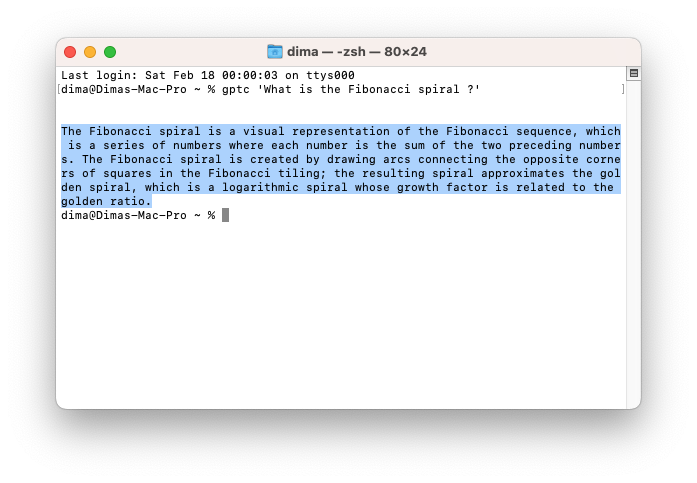

# ChatGPT-Console
ChatGPT-Console

Communication with ChatGPT using terminal.
Latest current version: 0.0.2

The program works only under macOS.

To use the program, we must drag it to the console and write a question, the question must be in quotation marks.

~ % gptc 'message'

The duration of the response may depend on the language you use!

Along with 'gptc', there is a file 'GPTInfo.json' it is important and should always be in the same folder as the main application, it specifies information such as YOUR_API_KEY_HERE and max_tokens.

What should I start with ?

1: We download [gptc](https://github.com/DiCode77/ChatGPT-Console.git)

2: Go to the OpenAI website and get your token, let's copy it [website](https://beta.openai.com/docs/api/overview)

3: Open the "GPTInfo.json" file with a text editor.

4: Find the 'YOUR_API_KEY_HERE' parameter, insert the received token instead.

5: Drag 'gptc' into the terminal and write your question in quotation marks -> gptc "Hello".
